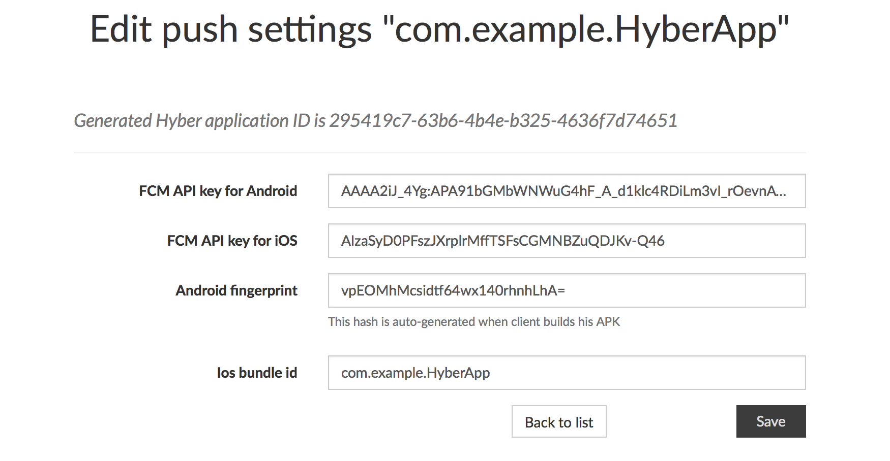

# Hyber SDK for Android
[![Release][release-svg]][release-link]
[![Build Status][ci-build-status-svg]][ci-build-status]
[![Codecov Status][codecov-svg]][codecov]

A library that gives you access to the powerful Hyber cloud platform from your Android app.
For more information about Hyber and its features, see [hyber.im][hyber.im].
***

### Introduction
First of all, you need to configure [Google Services Plugin][google-services-plugin] and [Firebase Cloud Messaging][firebase-cloud-messaging]

After that, you need to initialise the Hyber inside the onCreate method in your Application class.
```java
    Hyber.with(this, BuildConfig.HYBER_CLIENT_API_KEY)
        .setNotificationListener(...)
        .init();
```

Also, after that, you need to write next line to app level build.gradle file inside build config block
```
    buildConfigField 'String', 'HYBER_CLIENT_API_KEY', hyber_client_api_key
```
***

### Download
#### GRADLE
Add following repository to project level build.gradle:
```groovy
    maven { url 'https://raw.github.com/Incuube/Hyber-SDK-Android/maven/' }
```

Then add following dependencies to app level build.gradle:
```groovy
    compile 'com.hyber:hyber-messaging:2.2.2'
```

*Hyber SDK requires at minimum Java 7 or Android 4.1.*
***

### User control
#### User authorization management
```java
    //User registration
    Hyber.userRegistration(phone, password, new HyberCallback<EmptyResult, HyberError>() {
        @Override
        public void onSuccess() { /*User session is active*/ }
        @Override
        public void onFailure(HyberError error) { /*Something went wrong*/ }
    });

    //User logout
    Hyber.logoutCurrentUser(new LogoutUserHandler() {
        @Override
        public void onSuccess() { /*User is logout*/ }
        @Override
        public void onFailure(HyberError error) { /*Something went wrong*/ }
    });

    //Check user auth status
    Hyber.isAuthorized(new HyberCallback<EmptyResult, EmptyResult>() {
        @Override
        public void onSuccess(EmptyResult result) { /*User is authorized*/ }
        @Override
        public void onFailure(EmptyResult error) { /*User is not authorized*/ }
    });

    //Get current user info
    Hyber.getCurrentUser(new CurrentUserHandler() {
        @Override
        public void onCurrentUser(String id, String phone) { /*Return current user id and phone*/ }
    });
```
#### User's messages management
```java
    //Get access to stored user's messages and add change listeners
    Hyber.getAllUserMessages();

    //Get all user's messages from server and save it to local storage
    Hyber.getMessageHistory(historyStartTime, new HyberCallback<Long, HyberError>() {
        @Override
        public void onSuccess(@NonNull Long recommendedNextTime) { /*User's message list loaded and saved successfuly*/ }
        @Override
        public void onFailure(HyberError error) { /*Something went wrong*/ }
    });

    //Send answer for message
    Hyber.sendMessageCallback(messageId, answer, new HyberCallback<String, HyberError>() {
        @Override
        public void onSuccess(String result) { /*Answer is sent*/ }
        @Override
        public void onFailure(HyberError error) { /*Something went wrong*/ }
    });
```
#### User's devices management
```java
    //Get access to stored user's devices and add change listeners
    Hyber.getAllUserDevices();

    //Get all user's devices from server and save it to local storage
    Hyber.getAllDevices(new HyberCallback<EmptyResult, HyberError>() {
        @Override
        public void onSuccess(EmptyResult result) { /*User's device list loaded and saved successfuly*/ }
        @Override
        public void onFailure(HyberError error) { /*Something went wrong*/ }
    });

    //Revoke devices from user's authorized device list
    Hyber.revokeDevices(deviceIds, new HyberCallback<EmptyResult, HyberError>() {
        @Override
        public void onSuccess(EmptyResult result) { /*Devices is revoked*/ }
        @Override
        public void onFailure(HyberError error) { /*Something went wrong*/ }
    });
```
***

### PROGUARD
If you are using Proguard in your project add the following lines to your configuration:
```proguard

```

### Logging
For manipulation with logs from the library, you can create a subclass ```HyberLogger.Tree```.
Example:
```java
private class CrashReportingTree extends HyberLogger.Tree {
    @Override
    protected void log(int priority, String tag, String message, Throwable t) {
        if (priority <= Log.WARN) return; else {/*Do something with error*/}
    }
}
```

### KeyHash (Fingerprint)
To authenticate the exchange of information between your app and the Hyber platform, you need to generate a release/debug key hash and add this to the Hyber mobile app settings within your Hyber Application ID (Client API Key). Without this, your Hyber integration may not work well when you release/debug your app to the store and during development.

When publishing, an application is usually signed with a different signature in the development environment. Therefore, you want to make sure you create a Release Key Hash and add this to the Hyber mobile app settings for Hyber Application ID (Client API Key).

To generate a hash of your release key, run the following command on Mac or Windows substituting your release key alias and the path to your keystore.

On Mac OS, run:
```bash
keytool -exportcert -alias <RELEASE_KEY_ALIAS> -keystore <RELEASE_KEY_PATH> | openssl sha1 -binary | openssl base64
```

On Windows, you need the following steps:

- Key and Certificate Management Tool (keytool) from the Java Development Kit
- OpenSSL for Windows Library from the Google Code Archive

Run the following command in a command prompt in the Java SDK folder:
```bash
keytool -exportcert -alias <RELEASE_KEY_ALIAS> -keystore <RELEASE_KEY_PATH> | PATH_TO_OPENSSL_LIBRARY\bin\openssl sha1 -binary | PATH_TO_OPENSSL_LIBRARY\bin\openssl base64
```
Make sure to use the password that you set when you first created the release key.

This command should generate a 28 character string. Copy and paste this Release/Debug Key Hash into your Hyber Application ID's mobile application settings.



You can also manually modify the sample code to use the right key hash. For example in HelloHyberSampleActivity class make a temporary change to the onCreate():
```java
@Override
public void onCreate(Bundle savedInstanceState) {
    super.onCreate(savedInstanceState);

    // Add code to print out the key hash
    try {
        PackageInfo info = getPackageManager().getPackageInfo(
                "your.application.package",
                PackageManager.GET_SIGNATURES);
        for (Signature signature : info.signatures) {
            MessageDigest md = MessageDigest.getInstance("SHA");
            md.update(signature.toByteArray());
            Log.d("KeyHash:", Base64.encodeToString(md.digest(), Base64.DEFAULT));
            }
    } catch (NameNotFoundException e) {
    } catch (NoSuchAlgorithmException e) {
    }
    ...
```
Save your changes and re-run the sample. Check your logcat output for a message similar to this:
```bash
12-20 10:47:37.747: D/KeyHash:(936): 478uEnKQV+fMQT8Dy4AKvHkYibo=
```
Save the key hash in your Hyber profile. Re-run the samples and verify that you can log in successfully.

[release-svg]: http://github-release-version.herokuapp.com/github/Incuube/Hyber-SDK-Android/release.svg?style=flat
[release-link]: https://github.com/Incuube/Hyber-SDK-Android/releases/latest

[ci-build-status-svg]: https://travis-ci.org/Incuube/Hyber-SDK-Android.svg?branch=master
[ci-build-status]: https://travis-ci.org/Incuube/Hyber-SDK-Android

[codecov-svg]: https://codecov.io/gh/Incuube/Hyber-SDK-Android/branch/master/graph/badge.svg
[codecov]: https://codecov.io/gh/Incuube/Hyber-SDK-Android

[hyber.im]: https://hyber.im/
[google-services-plugin]: https://developers.google.com/android/guides/google-services-plugin
[firebase-cloud-messaging]: https://firebase.google.com/docs/cloud-messaging/android/client
